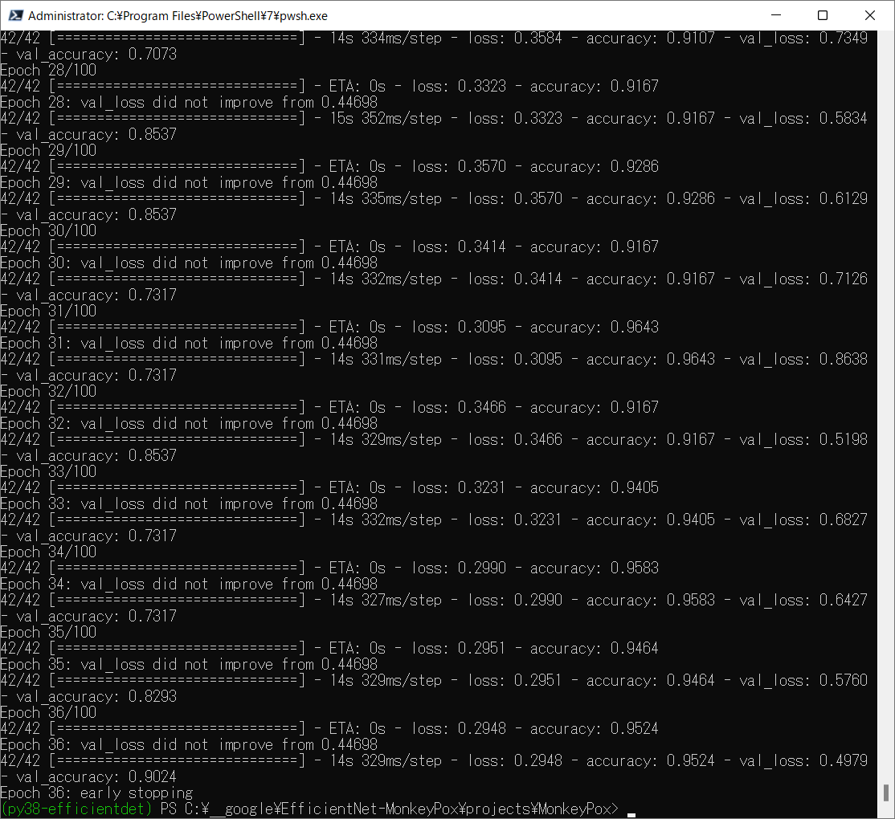
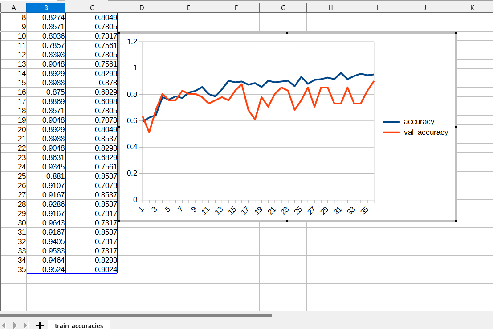
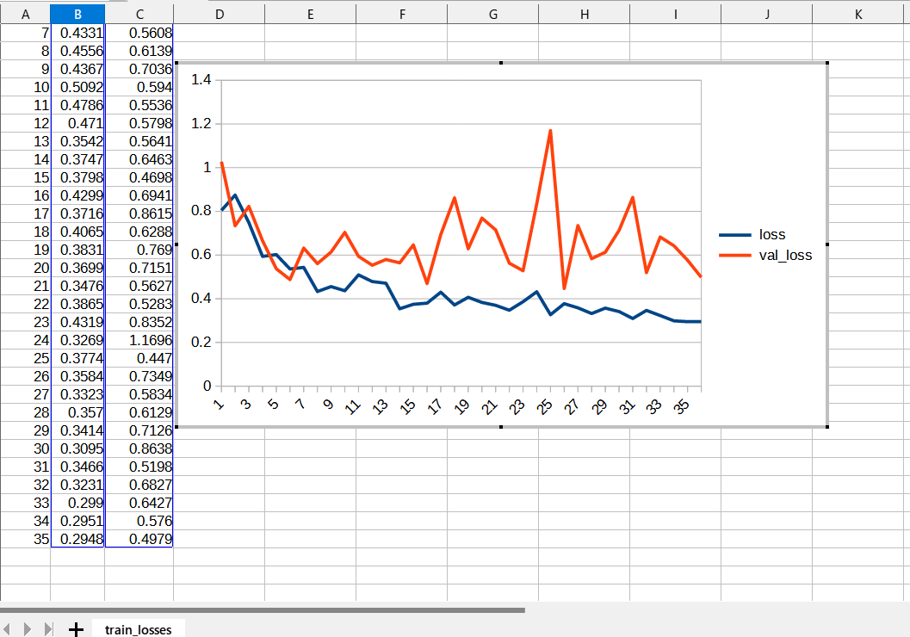
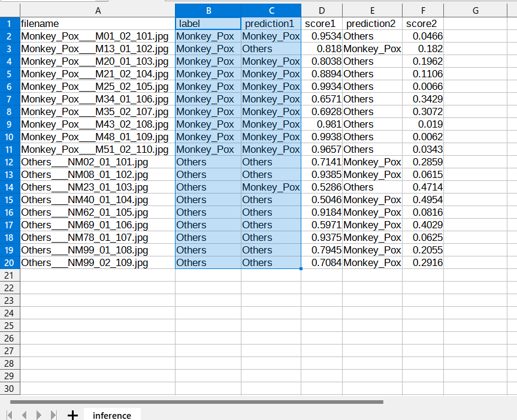

# EfficientNet-MonkeyPox
EfficientNetV2 MonkeyPox Classification

<h2>
1 EfficientNetV2 MonkeyPox Classification (Updated: 2022/08/02)
</h2>

This is a simple MonkeyPox Classification project based on <b>efficientnetv2</b> in <a href="https://github.com/google/automl">Brain AutoML</a>
The MonkeyPox dataset used here has been taken from the following web site: 
 <a href="https://www.kaggle.com/datasets/nafin59/monkeypox-skin-lesion-dataset">Monkeypox Skin Lesion Dataset</a>
 
 
See also the following google drive: 
https://drive.google.com/drive/folders/1bIYqAW-vqDBq3Ou_UMXPwgemqfZeqQi5
 
 
<b>Citation</b> 
Ali, S. N., Ahmed, M. T., Paul, J., Jahan, T., Sani, S. M. Sakeef, Noor, N., & Hasan, T. (2022). Monkeypox Skin Lesion Detection Using Deep Learning Models: A Preliminary Feasibility Study. arXiv preprint arXiv:2207.03342.
<pre>
@article{Nafisa2022,
title={Monkeypox Skin Lesion Detection Using Deep Learning Models: A Preliminary Feasibility Study},
author={Ali, Shams Nafisa and Ahmed, Md. Tazuddin and Paul, Joydip and Jahan, Tasnim and Sani, S. M. Sakeef and Noor, Nawshaba and Hasan, Taufiq},
journal={arXiv preprint arXiv:2207.03342},
year={2022}
}
</pre>

 We use python 3.8 and tensorflow 2.8.0 environment on Windows 11 for this project. 
<li>
We have udated <a href="./projects/MonkeyPox/data_generator.config">a data_generator.config</a> file to improve validation accuracy.
</li>
   
<h3>
1.1 Clone repository
</h3>
 Please run the following command in your working directory: 
<pre>
git clone https://github.com/atlan-antillia/EfficientNet-MonkeyPox.git
</pre>
You will have the following directory tree: 
<pre>
.
├─asset
├─g3doc
└─projects
    └─MonkeyPox
        ├─eval
        ├─inference
        ├─test
        ├─Testing
        │  ├─Monkey_Pox
        │  └─Others
        └─Training
            ├─Monkey_Pox
            └─Others
            
</pre>
The images in test, Testing and Training folders have been taken from
 <a href="https://www.kaggle.com/datasets/nafin59/monkeypox-skin-lesion-dataset">Monkeypox Skin Lesion Dataset</a>
  
 
Please run the following commnad to install Python packages for this project. 
<pre>
pip install -r requirements.txt
</pre>
 

<h2>
2 Python classes for MonkeyPox Classification
</h2>
We have defined the following python classes to implement our MonkeyPox Classification. 

<li>
<a href="./CustomDataset.py">CustomDataset</a>
</li>
<li>
<a href="./EpochChangeCallback.py">EpochChangeCallback</a>
</li>

<li>
<a href="./FineTuningModel.py">FineTuningModel</a>
</li>

<li>
<a href="./EfficientNetV2ModelTrainer.py">EfficientNetV2ModelTrainer</a>
</li>

<li>
<a href="./EfficientNetV2Inferencer.py">EfficientNetV2Inferencer</a>
</li>

<h2>
3 Pretrained model
</h2>
 We have used pretrained <b>efficientnetv2-m</b> to train MonkeyPox Classification Model by using
 <a href="https://www.kaggle.com/datasets/nafin59/monkeypox-skin-lesion-dataset">Monkeypox Skin Lesion Dataset</a>
Please download the pretrained checkpoint file from <a href="https://storage.googleapis.com/cloud-tpu-checkpoints/efficientnet/v2/efficientnetv2-m.tgz">efficientnetv2-m.tgz</a>, expand it, and place the model under our top repository.

<pre>
.
├─asset
├─efficientnetv2-m
├─g3doc
└─projects
    └─MonkeyPox
</pre>

<h2>
4 Train and inference script files
</h2>
<h3>
4.1 Train script
</h3>
Please run the following bat file to train our brain-tumor efficientnetv2 model. 
<pre>
./1_train.bat
</pre>
<pre>
rem 1_train.bat
python ../../EfficientNetV2ModelTrainer.py ^
  --model_dir=./models ^
  --model_name=efficientnetv2-m  ^
  --data_generator_config=./data_generator.config ^
  --ckpt_dir=../../efficientnetv2-m/model ^
  --optimizer=rmsprop ^
  --num_classes=2 ^
  --image_size=384 ^
  --eval_image_size=480 ^
  --data_dir=./Training ^
  --model_dir=./models ^
  --data_augmentation=True ^
  --fine_tuning=True ^
  --monitor=val_loss ^
  --learning_rate=0.001 ^
  --trainable_layers_ratio=0.3 ^
  --num_epochs=100 ^
  --batch_size=4 ^
  --patience=10 ^
  --debug=True  
</pre>
,where data_generator.config is the following 
<pre>
; data_generation.config

[training]
validation_split   = 0.2
featurewise_center = False
samplewise_center  = True
featurewise_std_normalization=False
samplewise_std_normalization =True
zca_whitening                =False

rotation_range     = 30
horizontal_flip    = True
       
width_shift_range  = 0.4
height_shift_range = 0.4
shear_range        = 0.1
zoom_range         = [0.8, 1.2]
;zoom_range          = 0.2
data_format        = "channels_last"

[validation]
validation_split   = 0.2
featurewise_center = False
samplewise_center  = True
featurewise_std_normalization=False
samplewise_std_normalization =True
zca_whitening                =False

rotation_range     = 30
horizontal_flip    = True
       
width_shift_range  = 0.4
height_shift_range = 0.4
shear_range        = 0.1
zoom_range         = [0.8, 1.2]
;zoom_range         = 0.2
data_format        = "channels_last"

</pre>

This will generate a <b>best_model.h5</b> in the models folder specified by --model_dir parameter. 
Furthermore, it will generate a <a href="./projects/MonkeyPox/eval/train_accuracies.csv">train_accuracies</a>
and <a href="./projects/MonkeyPox/eval/train_losses.csv">train_losses</a> files
 
Training console output: 
 
 
Train_accuracies: 
 

 
Train_losses: 
 

 

<h3>
4.2 Inference script
</h3>
Please run the following bat file to infer the brain tumors in test images by the model generated by the above train command. 
<pre>
./2_inference.bat
</pre>
<pre>
rem 2_inference.bat
python ../../EfficientNetV2Inferencer.py ^
  --model_name=efficientnetv2-m  ^
  --model_dir=./models ^
  --fine_tuning=True ^
  --trainable_layers_ratio=0.3 ^
  --image_path=./test/*.jpg ^
  --eval_image_size=480 ^
  --num_classes=2 ^
  --label_map=./label_map.txt ^
  --mixed_precision=True ^
  --infer_dir=./inference ^
  --debug=False 
</pre>
 
label_map.txt:
<pre>
Monkey_Pox
Others
</pre>
Sample test images generated by <a href="./projects/MonkeyPox/create_test_dataset.py">create_test_dataset.py</a> 
from <a href="./projects/MonkeyPox/Testing">Testing</a> taken from
 <a href="https://github.com/sartajbhuvaji/brain-tumor-classification-dataset">brain-tumor-classificaiton-dataset</a>. 
Monkey_Pox 
  
Monkey_Pox 
  
Others 
  
Others 
  

<h3>
4.3 Inference result
</h3>

This inference command will generate <a href="./projects/MonkeyPox/inference/inference.csv">inference result file</a>.
 
Inference console output: 
 
 
Inference result: 
 

