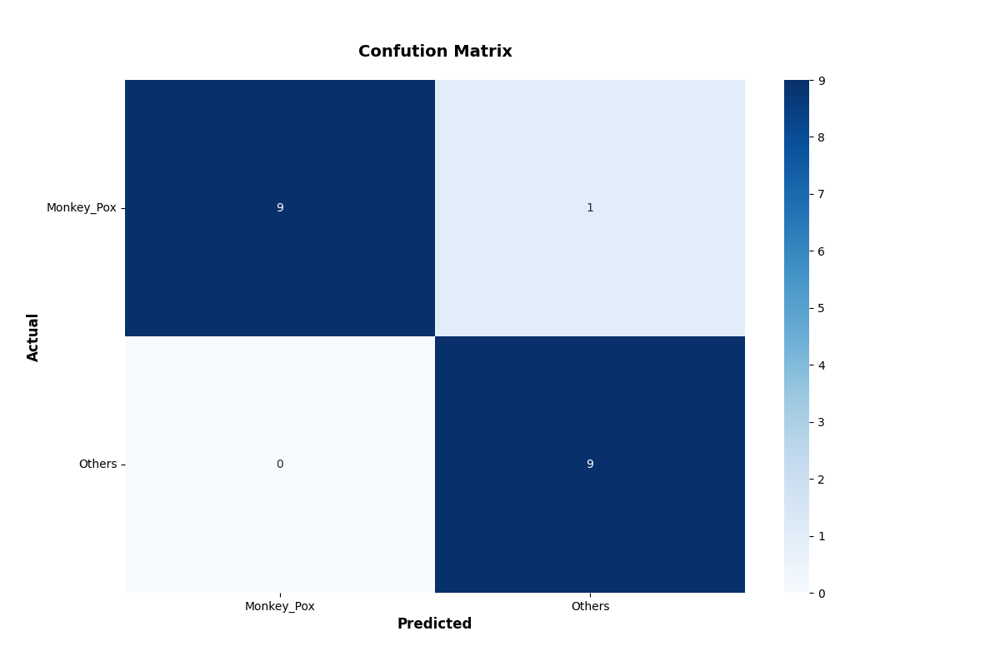

<h2>
EfficientNet MonkeyPox (Updated: 2022/08/08)
</h2>
<a href="#1">1 EfficientNetV2 MonkeyPox Skin Lesion Detection </a> 
<a href="#1.1">1.1 Clone repository</a> 
<a href="#1.2">1.2 Install Python packages</a> 
<a href="#2">2 Python classes for MonkeyPox Detection</a> 
<a href="#3">3 Pretrained model</a> 
<a href="#4">4 Train</a> 
<a href="#4.1">4.1 Train script</a> 
<a href="#4.2">4.2 Training result</a> 
<a href="#5">5 Inference</a> 
<a href="#5.1">5.1 Inference script</a> 
<a href="#5.2">5.2 Sample test images</a> 
<a href="#5.3">5.3 Inference result</a> 
<a href="#6">6 Evaluation</a> 
<a href="#6.1">6.1 Evaluation script</a> 
<a href="#6.2">6.2 Evaluation result</a> 

<h2>
<a id="1">1 EfficientNetV2 MonkeyPox Skin Lesion Detection</a>
</h2>

This is a simple MonkeyPox Skin Lesion Detection project based on <b>efficientnetv2</b> in <a href="https://github.com/google/automl">Brain AutoML</a>
The MonkeyPox dataset used here has been taken from the following web site: 
 <a href="https://www.kaggle.com/datasets/nafin59/monkeypox-skin-lesion-dataset">Monkeypox Skin Lesion Dataset</a>
 
 
See also the following google drive: 
https://drive.google.com/drive/folders/1bIYqAW-vqDBq3Ou_UMXPwgemqfZeqQi5
 
 
<b>Citation</b> 
Ali, S. N., Ahmed, M. T., Paul, J., Jahan, T., Sani, S. M. Sakeef, Noor, N., & Hasan, T. (2022). Monkeypox Skin Lesion Detection Using Deep Learning Models: A Preliminary Feasibility Study. arXiv preprint arXiv:2207.03342.
<pre>
@article{Nafisa2022,
title={Monkeypox Skin Lesion Detection Using Deep Learning Models: A Preliminary Feasibility Study},
author={Ali, Shams Nafisa and Ahmed, Md. Tazuddin and Paul, Joydip and Jahan, Tasnim and Sani, S. M. Sakeef and Noor, Nawshaba and Hasan, Taufiq},
journal={arXiv preprint arXiv:2207.03342},
year={2022}
}
</pre>

 We use python 3.8 and tensorflow 2.8.0 environment on Windows 11 for this project. 
<li>
2022/08/04: Added <a href="./EfficientNetV2Evaluator.py">EfficientNetV2Evaluator</a> class to evaluate Testing dataset.
</li>
<li>
2022/08/08: Udated <a href="./projects/MonkeyPox/data_generator.config">a data_generator.config</a> file to improve validation accuracy.
</li>
<li>
2022/08/08: Added <a href="./ClassificationReportWriter.py">ClassificationReportWriter</a> 
and <a href="./ConfusionMatrix.py">ConfusionMatrix</a> classes to evaluate Testing dataset.
</li>

 
   
<h3>
<a id="1.1">1.1 Clone repository</a>
</h3>
 Please run the following command in your working directory: 
<pre>
git clone https://github.com/atlan-antillia/EfficientNet-MonkeyPox.git
</pre>
You will have the following directory tree: 
<pre>
.
├─asset
├─g3doc
└─projects
    └─MonkeyPox
        ├─eval
        ├─inference
        ├─test
        ├─Testing
        │  ├─Monkey_Pox
        │  └─Others
        └─Training
            ├─Monkey_Pox
            └─Others
            
</pre>
The images in test, Testing and Training folders have been taken from
 <a href="https://www.kaggle.com/datasets/nafin59/monkeypox-skin-lesion-dataset">Monkeypox Skin Lesion Dataset</a>
  
 
<h3>
<a id="1.2">1.2 Install Python packages</a>
</h3>

Please run the following commnad to install Python packages for this project. 
<pre>
pip install -r requirements.txt
</pre>
 

<h2>
<a id="2">2 Python classes for MonkeyPox Detection</a>
</h2>
We have defined the following python classes to implement our MonkeyPox Detection. 

<li>
<a href="./ClassificationReportWriter.py">ClassificationResportWriter</a>
</li>
<li>
<a href="./ConfusionMatrix.py">ConfusionMatrix</a>
</li>
<li>
<a href="./CustomDataset.py">CustomDataset</a>
</li>
<li>
<a href="./EpochChangeCallback.py">EpochChangeCallback</a>
</li>
<li>
<a href="./FineTuningModel.py">FineTuningModel</a>
</li>
<li>
<a href="./EfficientNetV2Evaluator.py">EfficientNetV2Evaluator</a>
</li>

<li>
<a href="./EfficientNetV2ModelTrainer.py">EfficientNetV2ModelTrainer</a>
</li>

<li>
<a href="./EfficientNetV2Inferencer.py">EfficientNetV2Inferencer</a>
</li>
<li>
<a href="./TestDataset.py">TestDataset</a>
</li>
 

<h2>
<a id="3">3 Pretrained model</a>
</h2>
 We have used pretrained <b>efficientnetv2-m</b> to train MonkeyPox Detection Model by using
 <a href="https://www.kaggle.com/datasets/nafin59/monkeypox-skin-lesion-dataset">Monkeypox Skin Lesion Dataset</a>
Please download the pretrained checkpoint file from <a href="https://storage.googleapis.com/cloud-tpu-checkpoints/efficientnet/v2/efficientnetv2-m.tgz">efficientnetv2-m.tgz</a>, expand it, and place the model under our top repository.

<pre>
.
├─asset
├─efficientnetv2-m
├─g3doc
└─projects
    └─MonkeyPox
</pre>

<h2>
<a id="4">4 Train</a>
</h2>
<h3>
<a id="4.1">4.1 Train script</a>
</h3>
Please run the following bat file to train our MonkeyPox efficientnetv2 model by 
using <a href="./projects/MonkeyPox/Training">MonkeyPox Training dataset</a>. 
<pre>
./1_train.bat
</pre>
<pre>
rem 1_train.bat
python ../../EfficientNetV2ModelTrainer.py ^
  --model_dir=./models ^
  --model_name=efficientnetv2-m  ^
  --data_generator_config=./data_generator.config ^
  --ckpt_dir=../../efficientnetv2-m/model ^
  --optimizer=adam ^
  --image_size=384 ^
  --eval_image_size=480 ^
  --data_dir=./Training ^
  --model_dir=./models ^
  --data_augmentation=True ^
  --fine_tuning=True ^
  --monitor=val_loss ^
  --learning_rate=0.0015 ^
  --trainable_layers_ratio=0.4 ^
  --num_epochs=50 ^
  --batch_size=4 ^
  --patience=10 ^
  --debug=True  
</pre>
,where data_generator.config is the following 
<pre>
; data_generation.config

[training]
validation_split   = 0.2
featurewise_center = True
samplewise_center  = False
featurewise_std_normalization=True
samplewise_std_normalization =False
zca_whitening                =False
rotation_range     = 8
horizontal_flip    = True
vertical_flip      = True
 
width_shift_range  = 0.1
height_shift_range = 0.1
shear_range        = 0.1
zoom_range         = [0.5, 1.5]
;zoom_range         = 0.2
data_format        = "channels_last"

[validation]
validation_split   = 0.2
featurewise_center = True
samplewise_center  = False
featurewise_std_normalization=True
samplewise_std_normalization =False
zca_whitening                =False
rotation_range     = 8
horizontal_flip    = True
vertical_flip      = True
width_shift_range  = 0.1
height_shift_range = 0.1
shear_range        = 0.1
zoom_range         = [0.5, 1.5]
;zoom_range         = 0.2
data_format        = "channels_last"
</pre>

This will generate a <b>best_model.h5</b> in the models folder specified by --model_dir parameter. 
Furthermore, it will generate a <a href="./projects/MonkeyPox/eval/train_accuracies.csv">train_accuracies</a>
and <a href="./projects/MonkeyPox/eval/train_losses.csv">train_losses</a> files
 
<h3>
<a id="4.2">Training result</a>
</h3>

Training console output: 
 
 
Train_accuracies: 
 

 
Train_losses: 
 

 

<h2>
<a id="5">5 Inference</a>
</h2>
<h3>
<a id="5.1">5.1 Inference script</a>
</h3>
Please run the following bat file to infer the MonkeyPox test images by the model generated by the above train command. 
<pre>
./2_inference.bat
</pre>
<pre>
rem 2_inference.bat
python ../../EfficientNetV2Inferencer.py ^
  --model_name=efficientnetv2-m  ^
  --model_dir=./models ^
  --fine_tuning=True ^
  --trainable_layers_ratio=0.4 ^
  --image_path=./test/*.jpg ^
  --eval_image_size=480 ^
  --label_map=./label_map.txt ^
  --mixed_precision=True ^
  --infer_dir=./inference ^
  --debug=False
</pre>
, where label_map.txt is the following: 
<pre>
Monkey_Pox
Others
</pre>
 

<h3>
<a id="5.2">5.2 Sample test images</a>
</h3>

Sample test images generated by <a href="./projects/MonkeyPox/create_test_dataset.py">create_test_dataset.py</a> 
from <a href="./projects/MonkeyPox/Testing">Testing</a> taken from
 <a href="https://github.com/sartajbhuvaji/brain-tumor-classification-dataset">brain-tumor-classificaiton-dataset</a>. 
Monkey_Pox 
  
Monkey_Pox 
  
Others 
  
Others 
  

<h3>
<a id="5.3">5.3 Inference result</a>
</h3>

This inference command will generate <a href="./projects/MonkeyPox/inference/inference.csv">inference result file</a>.
 
Inference console output: 
 
 
Inference result: 
 

<h2>
<a id="6">6 Evaluation</a>
</h2>
<h3>
<a id="6.1">6.1 Evaluation script</a>
</h3>
Please run the following bat file to evaluate <a href="./projects/MonkeyPox/Testing">MonkeyPox Testing dataset</a> by the trained model. 
<pre>
./3_evaluate.bat
</pre>
<pre>
rem 3_evaluate.bat
python ../../EfficientNetV2Evaluator.py ^
  --model_name=efficientnetv2-m  ^
  --model_dir=./models ^
  --data_dir=./Testing ^
  --evaluation_dir=./evaluation ^
  --fine_tuning=True ^
  --trainable_layers_ratio=0.4 ^
  --eval_image_size=480 ^
  --label_map=./label_map.txt ^
  --mixed_precision=True ^
  --debug=False 
</pre>

<h3>
<a id="6.2">6.2 Evaluation result</a>
</h3>

This evaluation command will generate <a href="./projects/MonkeyPox/evaluation/classification_report.csv">a classification report</a>
 and <a href="./projects/MonkeyPox/evaluation/confusion_matrix.png">a confusion_matrix</a>.
 
 
Evaluation console output: 
 
 

Classification report: 
 
 
Confusion matrix: 
 

